## Evaluation Criteria (100 points for covering all criteria)

1. **Prometheus Installation (20 points)**
   - Prometheus is installed and running on the K8s cluster.

    - https://github.com/CiscoSA/rs-prometheus/actions/runs/12099099331/job/33736300042#step:7:7

    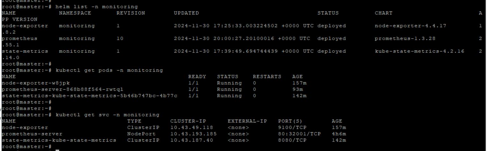

2. **Deployment Automation (30 points)**
   - Automation of deployment with IaC or CI/CD pipeline is created.

  - https://github.com/CiscoSA/rs-prometheus/pull/1

  - https://github.com/CiscoSA/rs-prometheus/blob/task_7/.github/workflows/deploy.yml

3. **Web interface is available (10 points)**
   - Metrics can be checked via Prometheus web interface.
     
     Of course, it is possible to have direct access to Prometheus from the Internet, and I am providing a screenshot as proof. However, this is a temporary solution and is not advisable due to security concerns.

     
     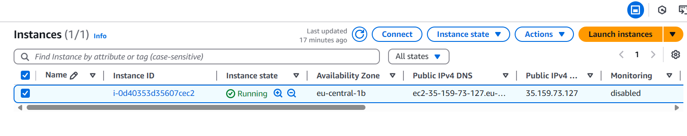

     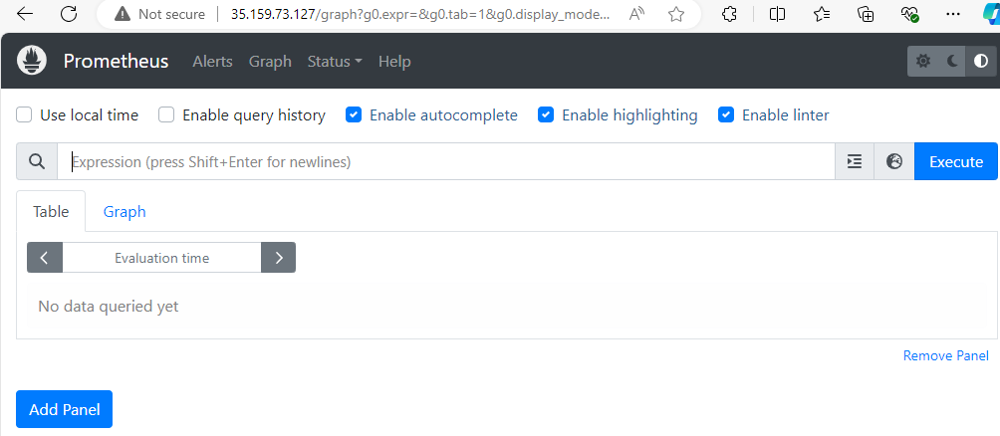
     

     Access to Prometheus is secured through Nginx proxying, with the added protection of a Let's Encrypt certificate. Nginx is installed on the bastion host and is configured to proxy only Grafana, not Prometheus. This setup provides an additional layer of protection for Prometheus, effectively preventing unauthorized access to the application.

     A screenshot of the Grafana dashboard has been included, along with the URL for accessing Grafana: https://rs-test.cloudns.cl/
  
  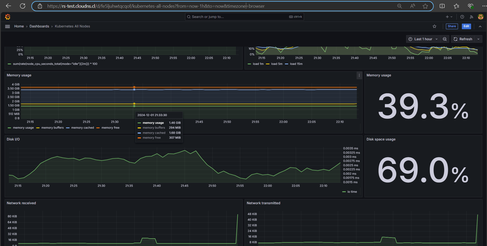

4. **Metrics Collection (35 points)**
   - Prometheus is collecting essential cluster-specific metrics, such as nodes' memory usage.
     
     All further work with Prometheus will be conducted through a secure tunnel to ensure better protection and prevent unauthorized access.

  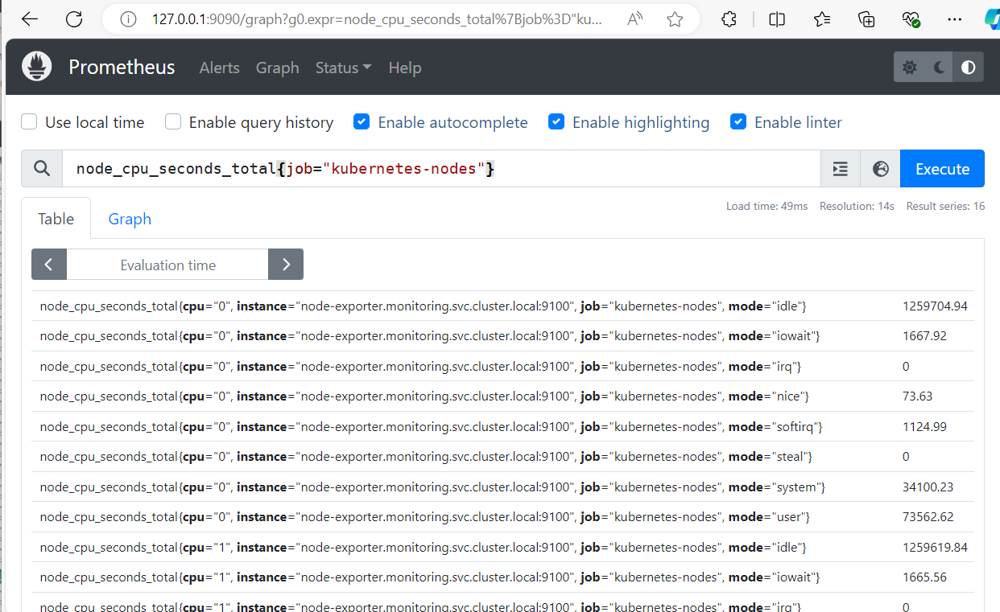
  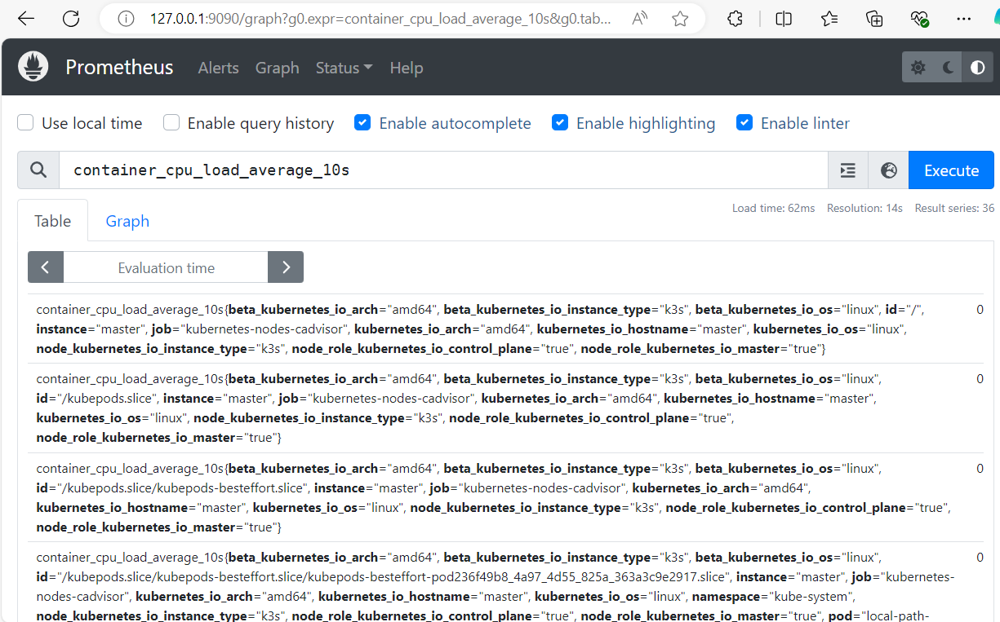

  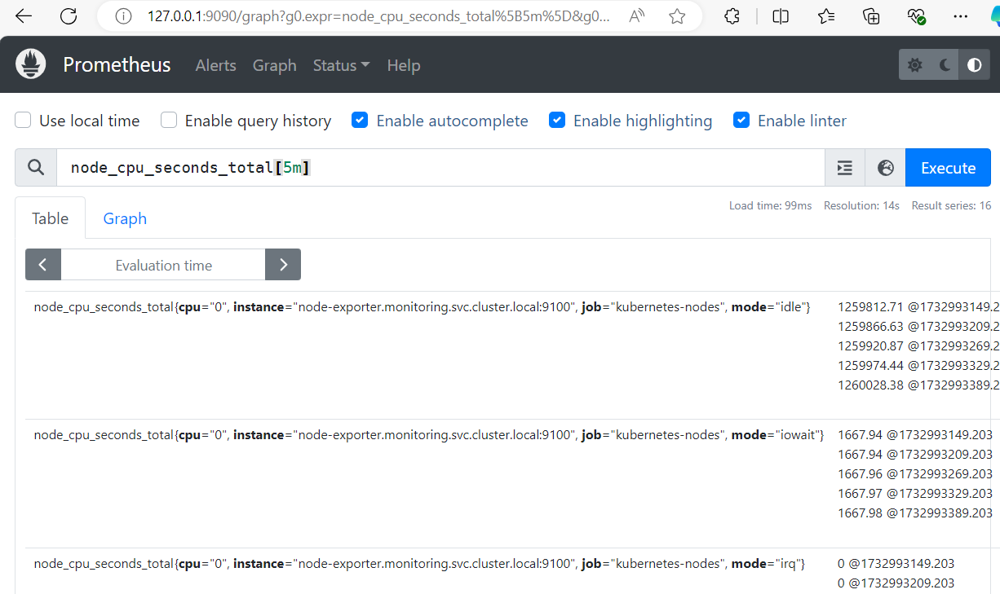
  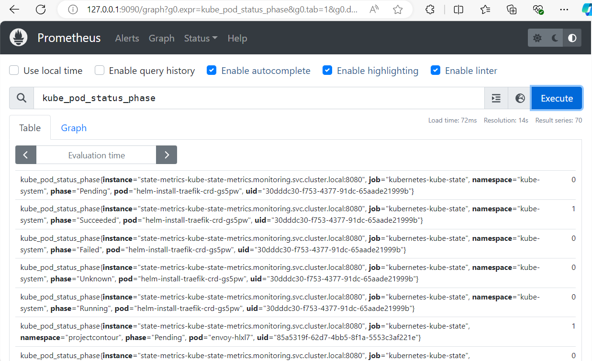
  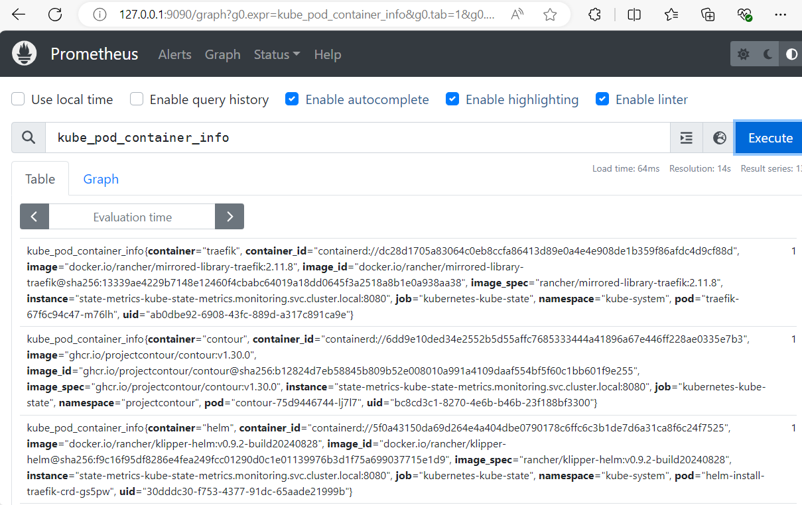
  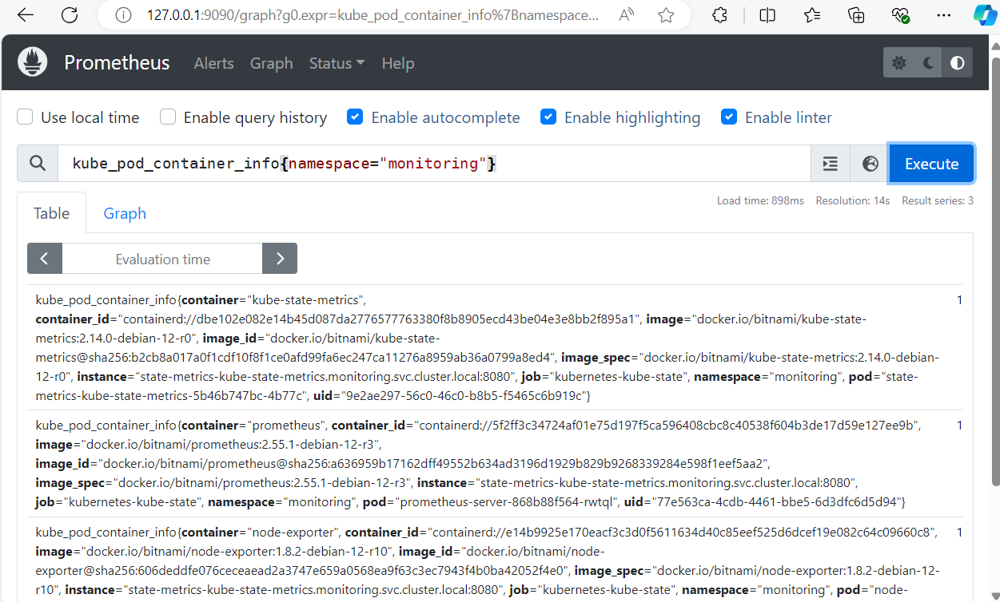
  
  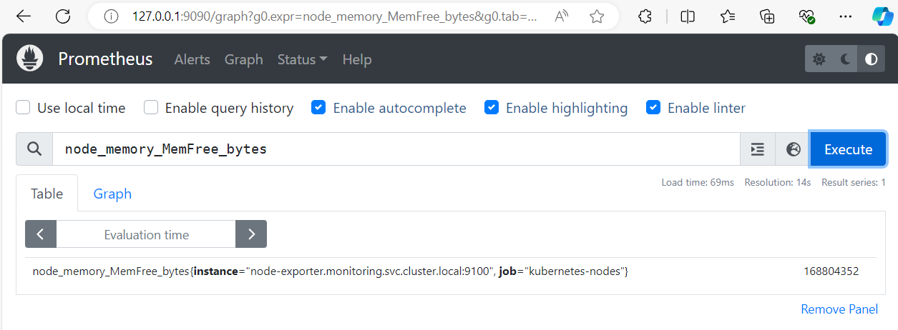
  

5. **Documentation is created (5 points)**
   - A README file is created or updated documenting the Prometheus deployment and configuration.

     - https://github.com/CiscoSA/rs-prometheus/blob/task_7/README.md