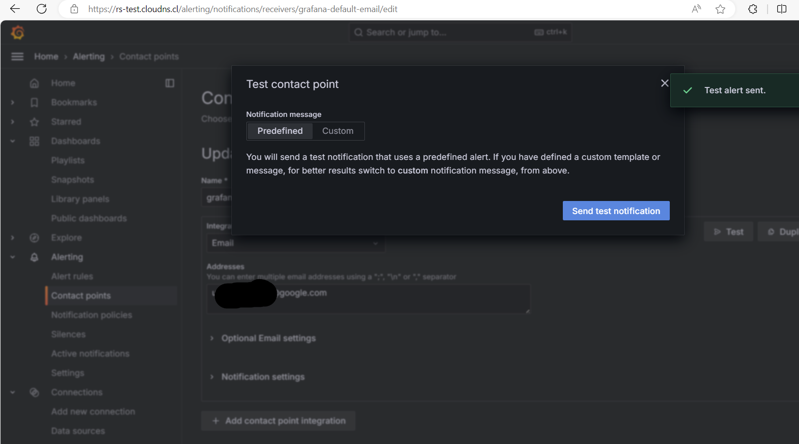
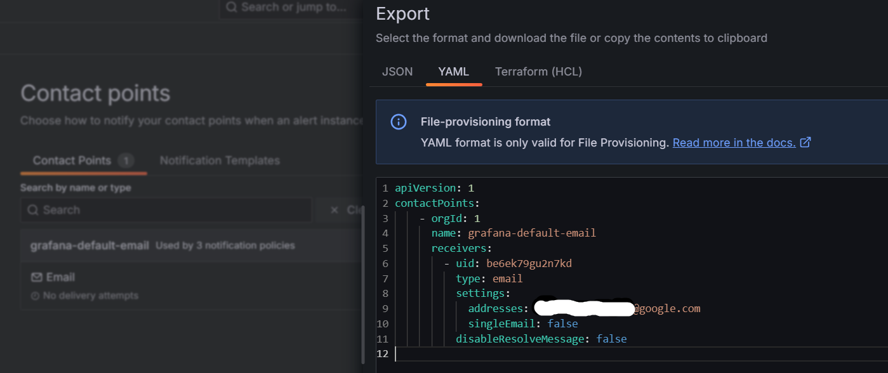
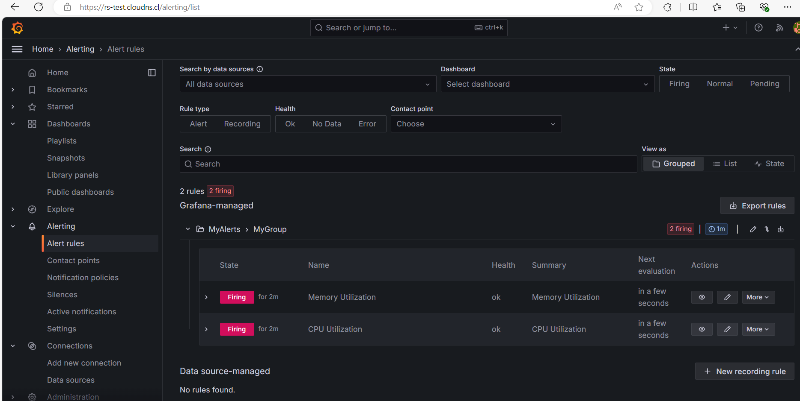
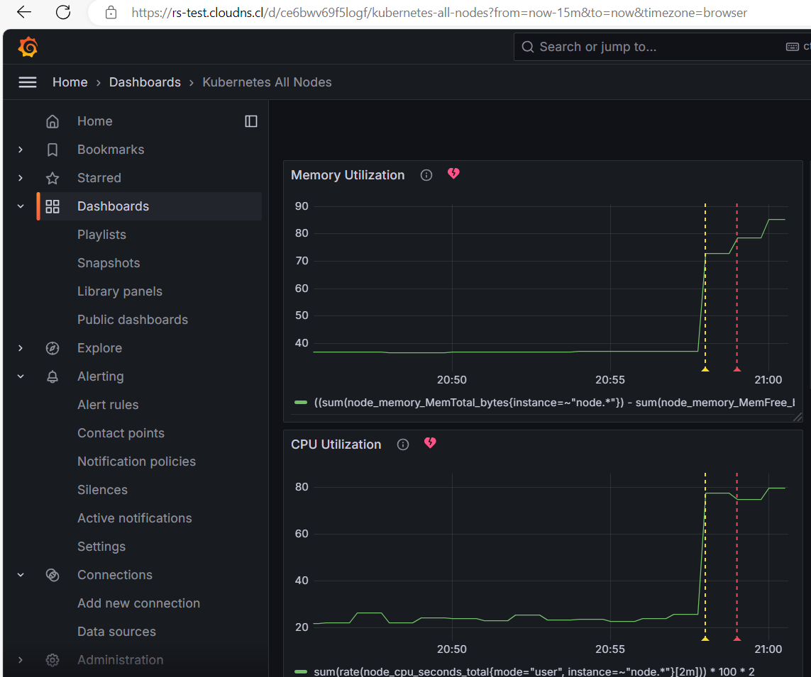
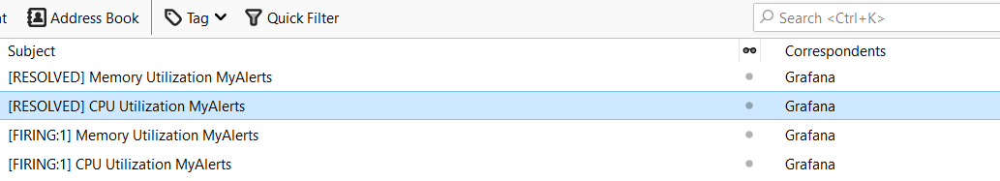
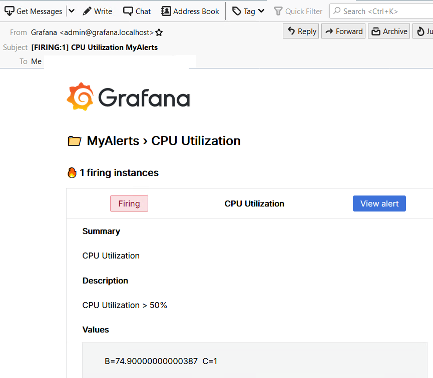
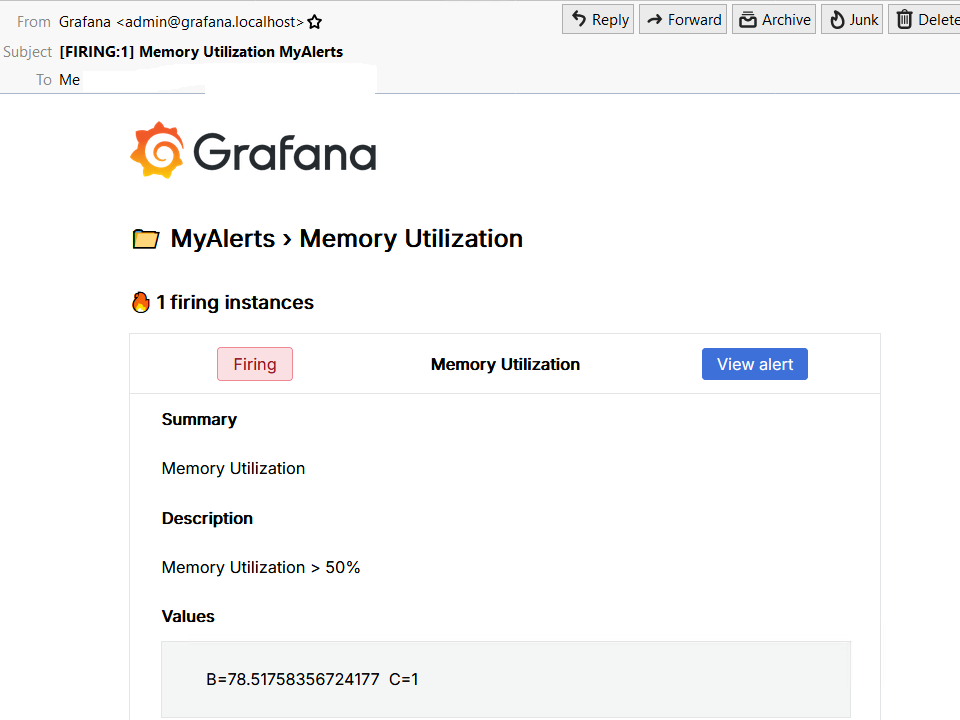
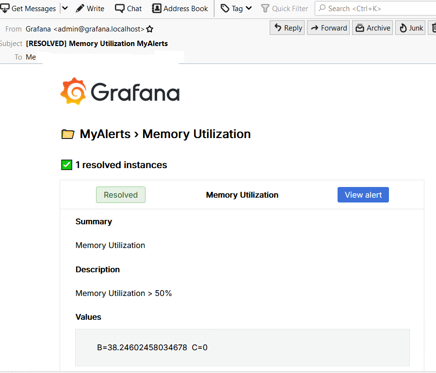

## Evaluation Criteria (100 points for covering all criteria)

1. **Contact Points created (10 points)**

    

    

2. **Alert Rules created (40 points)**
   - Alert Rules are configured to send alerts for the following events:
     - High CPU utilization on any node of the cluster.
     - Lack of RAM capacity on any node of the cluster.
       
       https://github.com/CiscoSA/rs-prometheus/blob/task_9/grafana/alerts.yaml

    

    

   - Alerts are configured to be delivered to your email address.

     !!! TODO !!!

3. **Alert Rules are working as expected (20 points)**
   - Alert Rules are firing when the specified events occur.

    

           

4. **Email is received (10 points)**

    

    

    

    

    

5. **Additional Tasks (20 points)**
   - **Documentation (10 points)**
     - The Alertmanager setup and alert configuration are documented in a README file.

       https://github.com/CiscoSA/rs-prometheus/blob/task_9/README.md

   - **Configuration is done completely in code (10 points)**

     - Alert Rules, Contact Points, and SMTP settings are configured using YAML files or other code-based methods.
       
       https://github.com/CiscoSA/rs-prometheus/blob/task_9/grafana/alerts.yaml

       https://github.com/CiscoSA/rs-prometheus/blob/task_9/grafana/contact.yaml

       https://github.com/CiscoSA/rs-prometheus/blob/task_9/grafana/dashboard.yaml

       https://github.com/CiscoSA/rs-prometheus/blob/task_9/grafana/smtp.yaml
